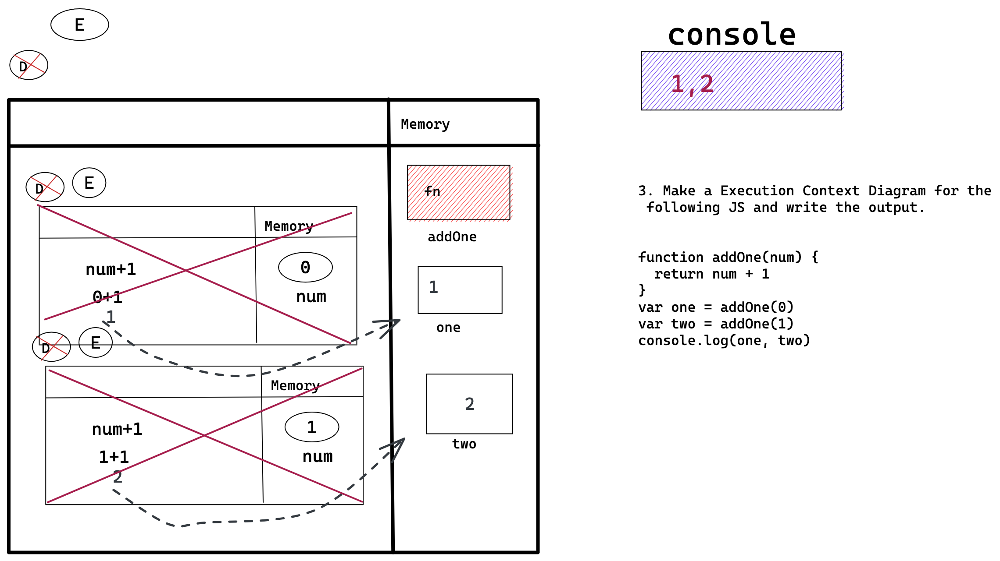
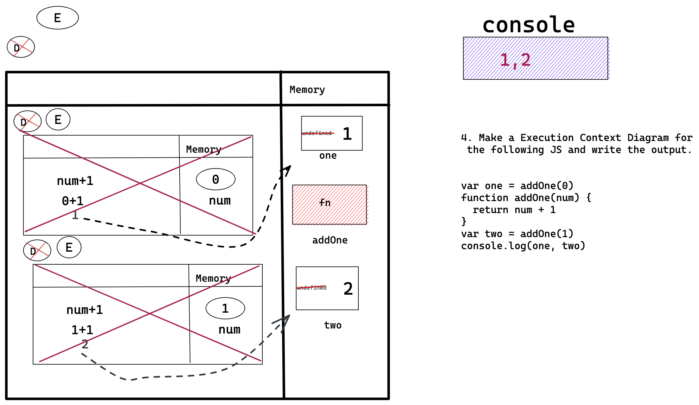
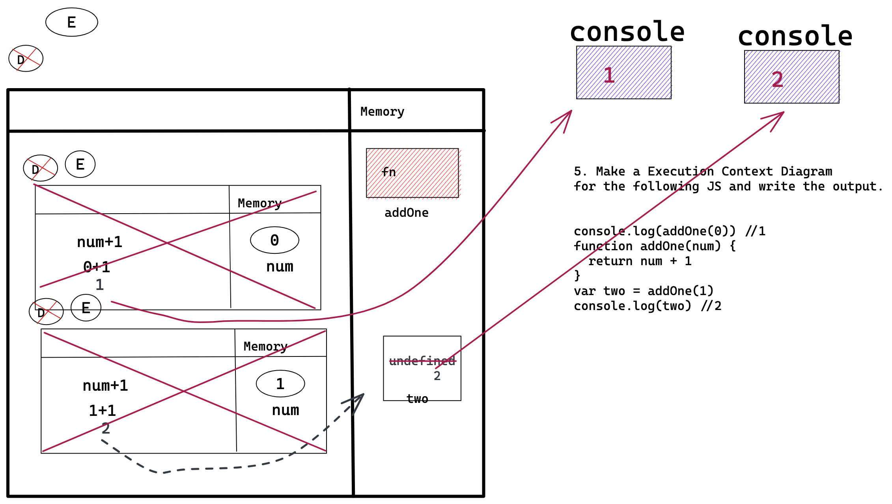
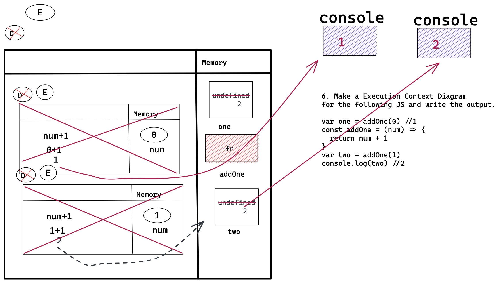
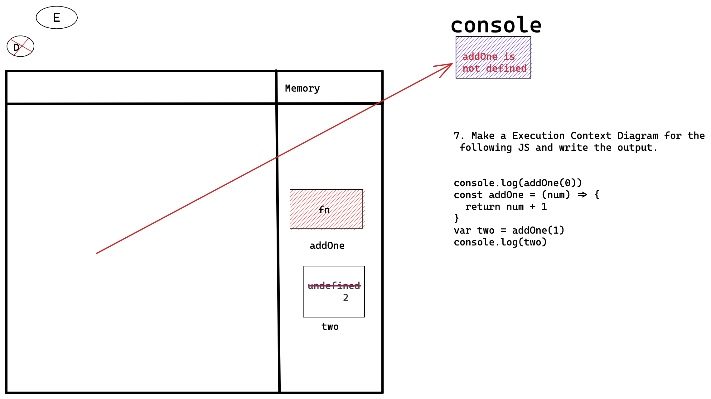

## Understanding Scope and the difference between var, let and const

Watch this video before doing the exercise: https://www.youtube.com/watch?v=XgSjoHgy3Rk

1. Guess the output:

```js
let firstName = 'Arya'
const lastName = 'Stark'
var knownAs = 'no one'

console.log(window.firstName, window.lastName, window.knownAs)
//undefined
//undefined
//'no one'
```

2. Guess the output:

```js
let firstName = 'Arya'
const lastName = 'Stark'
var knownAs = 'no one'

function fullName(a, b) {
  return a + b
}

console.log(window.fullName(firstName, lastName))
//`AryaStark`
```

3. Make a Execution Context Diagram for the following JS and write the output.

```js
function addOne(num) {
  return num + 1
}
var one = addOne(0)
var two = addOne(1)
console.log(one, two)
//1,2

```

4. Make a Execution Context Diagram for the following JS and write the output.

```js
var one = addOne(0)
function addOne(num) {
  return num + 1
}
var two = addOne(1)
console.log(one, two)
//1,2
```

5. Make a Execution Context Diagram for the following JS and write the output.

```js
console.log(addOne(0)) //1
function addOne(num) {
  return num + 1
}
var two = addOne(1)
console.log(two) //2
```

6. Make a Execution Context Diagram for the following JS and write the output.

```js
var one = addOne(0) //1
const addOne = (num) => {
  return num + 1
}
var two = addOne(1)
console.log(two) //2
```

7. Make a Execution Context Diagram for the following JS and write the output.

```js
console.log(addOne(0))
const addOne = (num) => {
  return num + 1
}
var two = addOne(1)
console.log(two)
// ReferenceError: addOne is not defined
```

8. What will be the output of the following

```js
function isAwesome() {
  var awesome
  if (false) {
    awesome = true
  }
  console.log(awesome)
}
isAwesome()
//undefined
```

9. What will be the output of the following

```js
function isAwesome() {
  let awesome
  if (true) {
    awesome = true
  }
  console.log(awesome)
}
isAwesome()
//true
```

10. What will be the output of the following

```js
function isAwesome() {
  let awesome
  if (false) {
    awesome = true
  }
  console.log(awesome)
}
isAwesome()
//undefined
```

11. What will be the output of the following

```js
let firstName = 'Arya'
const lastName = 'Stark'
var knownAs = 'no one'

function fullName(a, b) {
  return a + b
}
const name = fullName(firstName, lastName)
console.log(name)
//`AryaStark`
```

12. Guess the output of the code below with a reason.

```js
function sayHello() {
  let name = 'Arya Stark'
}
sayHello()

console.log(name)
//In this name is not initialized so that variable is not access because variable is defined by using let  scope.
```

13. Guess the output of the code below with a reason.

```js
if (true) {
  var name = 'Arya Stark'
}
console.log(name)
//'Arya Stark'
// In this we using var scope so that it initialized the varible and give access to outside the if statement.
```

14. Guess the output of the code below with a reason.

```js
if (true) {
  let name = 'Arya Stark'
}
console.log(name)
//In this we using let scope so that it cannot initialized the varible and no  access to outside the if statement.
```

15. Guess the output of the code below with a reason.

```js
for (var i = 0; i < 20; i++) {
  //
}
console.log(i)
//20
//In this we using var scope so that it initialized the varible and give access to outside the for loop.
```

16. Guess the output of the code below with a reason.

```js
for (let i = 0; i < 20; i++) {
  //
}
console.log(i)
//ReferenceError: i is not defined
//In this we using let scope so that it cannot initialized the varible and no access to outside the for loop so it give a error message that varible is not defined.
```

17. Guess the output and the reason behind that.

```js
function sample() {
  if (true) {
    var username = 'John Snow'
  }
  console.log(username)
}
sample()
//'John Snow'
// In this we using var scope so that it initialized the varible and give access to outside the if statement.

```

18. Guess the output and the reason behind that.

```js
function sample() {
  if (true) {
    let username = 'John Snow'
  }
  console.log(username)
}
sample()
//ReferenceError: username is not defined
//In this we using let scope so that it cannot initialized the varible and no access to outside the if statement. So it give a error message that varible is not defined.
```

19. Guess the output and the reason behind that.

```js
function sample() {
  var username = 'Arya Stark'
  if (true) {
    var username = 'John Snow'
    console.log(username)
  }
  console.log(username, 'second')
}
sample()
//'John Snow'
//'John Snow second'
 //In this we using var scope so that it initialized the varible and give access to outside the if statement
 //And javaScript work step by step.
```

20. Guess the output and the reason behind that.

```js
function sample() {
  let username = 'Arya Stark'
  if (true) {
    let username = 'John Snow'
    console.log(username, 'first')
  }
  console.log(username, 'second')
}
sample()
//John Snow first
//Arya Stark second
 //In this we using let scope so that it cannot initialized the varible and no access to outside the if statement so that it will take a first value of varible.
```

21. Guess the output and the reason behind that.

```js
function sample(...args) {
  for (let i = 0; i < args.length; i++) {
    let message = `Hello I am ${args[i]}`
    console.log(message)
  }
}

sample('First', 'Second', 'Third')
//Hello I am First
//Hello I am Second
//Hello I am Third
//In this we use a spread/rest operater it covert argument as a element in array after we run a loop.
```

22. Guess the output and the reason behind that.

```js
function sample(...args) {
  for (let i = 0; i < args.length; i++) {
    const message = `Hello I am ${args[i]}`
    console.log(message)
  }
}

sample('First', 'Second', 'Third')
//Hello I am First
//Hello I am Second
//Hello I am Third
////In this we use a spread/rest operater it covert argument as a element in array after we run a loop.
```

23. Guess the output and the reason behind that.

```js
if (true) {
  const myFunc = function () {
    console.log(username, 'Second')
  }
  console.log(username, 'First') //Reference erro:Cannot access 'username' before initialization
  let username = 'Hello World!'
  myFunc()
}
//it give a reference error because it is not initialized.
```

24. Guess the output and the reason behind that.

```js
function outer() {
  let movie = 'Mad Max: Fury Road'
  function inner() {
    console.log(`I love this movie called ${movie.toUpperCase()}`)
  }
  inner()
}

outer()
//`I love this movie called MAD MAX: FURY ROAD`
//In that we can access outside variable inside the function.
```

25. Guess the output and the reason behind that.

```js
function outer() {
  let movie = 'Mad Max: Fury Road'
  function inner() {
    let movie = 'Before Sunrise'
    console.log(`I love this movie called ${movie.toUpperCase()}`)
  }
  inner()
}

outer()
//`I love this movie called BEFORE SUNRISE`

```

26. Guess the output and the reason behind that.

```js
function outer() {
  let movie = 'Mad Max: Fury Road'
  function inner() {
    let movie = 'Before Sunrise'
    function extraInner() {
      let movie = 'Gone Girl'
      console.log(`I love this movie called ${movie.toUpperCase()}`)
    }
    extraInner()
  }
  inner()
}
outer()
//`I love this movie called GONE GIRL`
```

30. Using reduce find the final value when the initial value passed is `100`. You have to pass the output of one function into the input of next function in the array `allFunctions` starts with `addOne` ends with `half`.

```js
const addOne = (num) => {
  return num + 1
}
const subTwo = (num) => {
  return num - 2
}
const multiplyThree = (num) => {
  return num * 3
}
const half = (num) => {
  return num / 2
}

let allFunctions = [addOne, subTwo, multiplyThree, addOne, multiplyThree, half]

function call(arry) {
  return arry.reduce((acc, cv) => {
    acc = cv(acc)
    return acc
  }, 100)
}
call(allFunctions)
// Answer is: 447
```
